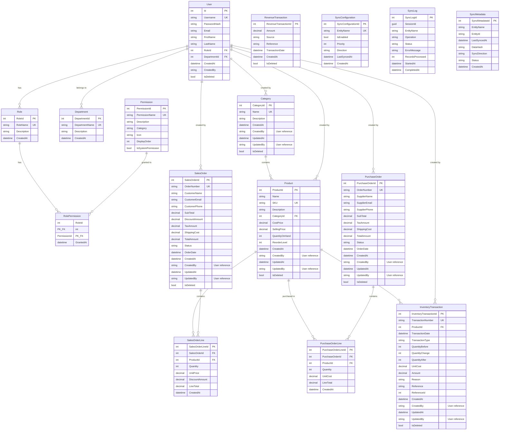

# ModularSys Database ERD

## Copy this code to https://mermaid.live

## Database Statistics

### Total Tables: 20

**Core System (5 tables):**
- User
- Role
- Permission
- RolePermission
- Department

**Inventory (8 tables):**
- Category
- Product
- SalesOrder
- SalesOrderLine
- PurchaseOrder
- PurchaseOrderLine
- InventoryTransaction
- RevenueTransaction

**Sync System (3 tables):**
- SyncConfiguration
- SyncLog
- SyncMetadata

**CRM (4 tables - Not in use):**
- Customer
- Contact
- Lead
- Opportunity

## Key Relationships

1. **User Management:**
   - User → Role (Many-to-One)
   - User → Department (Many-to-One)
   - Role ↔ Permission (Many-to-Many via RolePermission)

2. **Inventory:**
   - Category → Product (One-to-Many)
   - Product → SalesOrderLine (One-to-Many)
   - Product → PurchaseOrderLine (One-to-Many)
   - Product → InventoryTransaction (One-to-Many)
   - SalesOrder → SalesOrderLine (One-to-Many)
   - PurchaseOrder → PurchaseOrderLine (One-to-Many)

3. **Audit Trail (User → Inventory):**
   - User → Product (CreatedBy/UpdatedBy)
   - User → Category (CreatedBy/UpdatedBy)
   - User → SalesOrder (CreatedBy/UpdatedBy)
   - User → PurchaseOrder (CreatedBy/UpdatedBy)
   - User → InventoryTransaction (CreatedBy/UpdatedBy)

4. **Sync System:**
   - Independent tracking tables
   - No foreign key relationships

## Security & Accountability

### ✅ Is This Safe? YES!

**Why the modular design is secure:**

1. **Audit Trail Present:**
   - Every inventory record tracks `CreatedBy` and `UpdatedBy`
   - Full accountability for who did what
   - Soft delete tracks `DeletedBy`

2. **Permission-Based Access:**
   - Users need specific permissions (e.g., "Products.Create")
   - Role-based access control (RBAC) enforced
   - No direct database access without authentication

3. **Modular Architecture Benefits:**
   - ✅ **Separation of Concerns** - User management separate from inventory
   - ✅ **Scalability** - Can deploy inventory module independently
   - ✅ **Flexibility** - Easy to add new modules without affecting core
   - ✅ **Maintainability** - Changes to inventory don't affect user system

4. **Soft Foreign Keys (String References):**
   - `CreatedBy` stores username (string) not UserId (int)
   - **Pros:**
     - Works across distributed systems
     - No cascade delete issues
     - Module independence
   - **Cons:**
     - No database-level referential integrity
     - Requires application-level validation

### 🔒 Security Measures in Place:

1. **Authentication Required** - All inventory operations require login
2. **Permission Checks** - Role-based access control on every action
3. **Audit Logging** - Who, what, when tracked on all records
4. **Soft Deletes** - Data never truly deleted, can be recovered
5. **Change Tracking** - UpdatedBy/UpdatedAt on modifications

### ⚠️ Trade-offs:

**Loose Coupling (Current):**
- ✅ Module independence
- ✅ Easier deployment
- ✅ Better scalability
- ❌ No DB-level referential integrity
- ❌ Orphaned records possible if user deleted

**Tight Coupling (Alternative):**
- ✅ Database enforces relationships
- ✅ No orphaned records
- ❌ Modules tightly coupled
- ❌ Harder to scale/deploy separately

### 💡 Recommendation:

**Current design is SAFE and APPROPRIATE for:**
- Modular architecture
- Microservices approach
- Cloud deployment
- Multi-tenant systems

**Consider adding:**
- Application-level validation to check user exists
- Background job to clean orphaned references
- Logging/monitoring for audit trail integrity

## Soft Delete Pattern

Tables with soft delete (IsDeleted flag):
- User
- Department
- Category
- Product
- SalesOrder
- PurchaseOrder
- InventoryTransaction
- RevenueTransaction

## Audit Fields

Most tables include:
- CreatedAt
- CreatedBy
- UpdatedAt
- UpdatedBy
- DeletedAt
- DeletedBy
